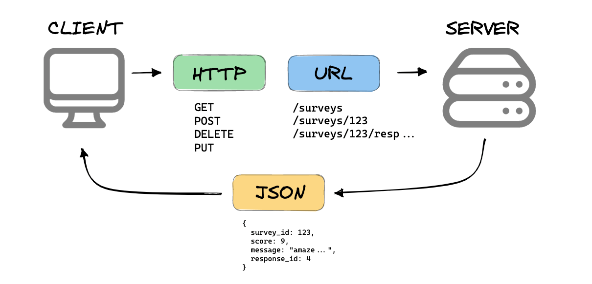

### University of Edinburgh 
# APIs and Machine Learning

### Introduction to APIs
- [What is an API](https://www.freecodecamp.org/news/what-is-an-api-in-english-please-b880a3214a82/)?
  - What do we use them for? Why?
  
- HTTP(s)
  - Requests/Responses
- API Structures
  - [REST](https://restful-api.dev/rest-fundamentals/#rest)
    - [HTTP Verbs](https://restful-api.dev/rest-fundamentals/#get)
    - [HTTP Status Codes](https://www.restapitutorial.com/httpstatuscodes.html)
    - URL Structures (Resources)
  - GraphQL
    - Problems with REST
    - [Demo](https://countries.trevorblades.com/)
- HTTP Requests from Python
  - [Requests](https://pypi.org/project/requests/) lib
  - EXERCISE 1 - GETting data
    ```
    Get the latest Bitcoin price data and output the price of one bitcoin in USD
    ```
  - EXERCISE 2 - POSTing data
    ```
    Create a post request ...
    ```
- [ChatGPT API](https://platform.openai.com/docs/quickstart?context=python)
  - [API keys](https://platform.openai.com/api-keys)
  - [OpenAi pip library](https://pypi.org/project/openai/)
    - `pip install --upgrade openai`
  - EXERCISE
    ```
    Create a command line chat script that communicated with ChatGPT via the API
    ```

- [Pandas](https://pandas.pydata.org/)
  - What is it?
  - Dataframes
  - EXERCISE
  ```
  Load this data from our API and put it into a Pandas Dataframe
  ```
